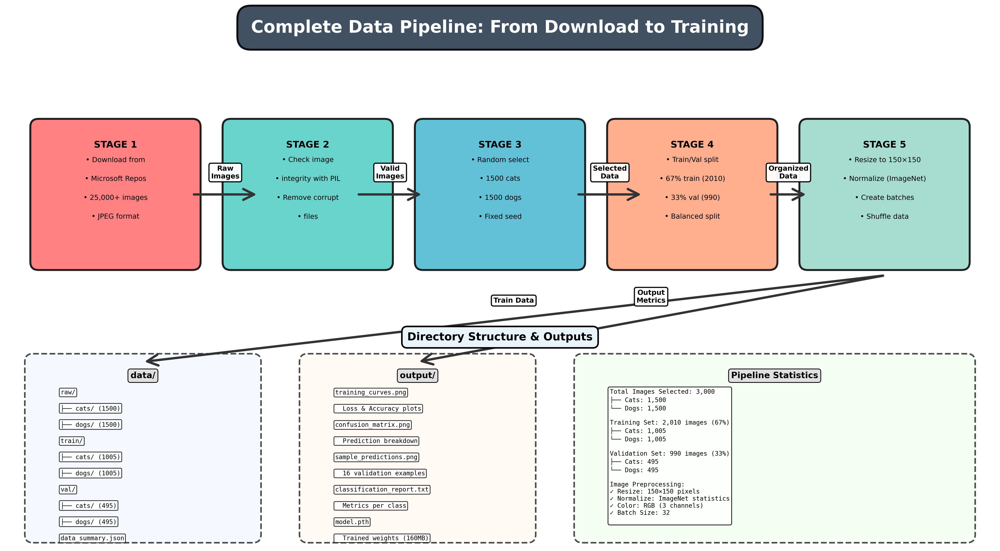
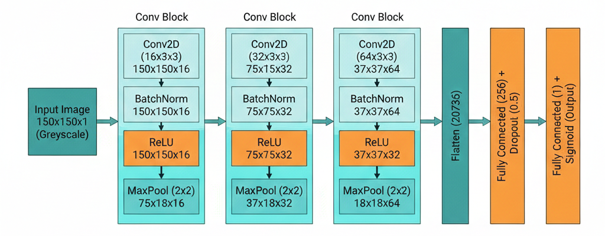
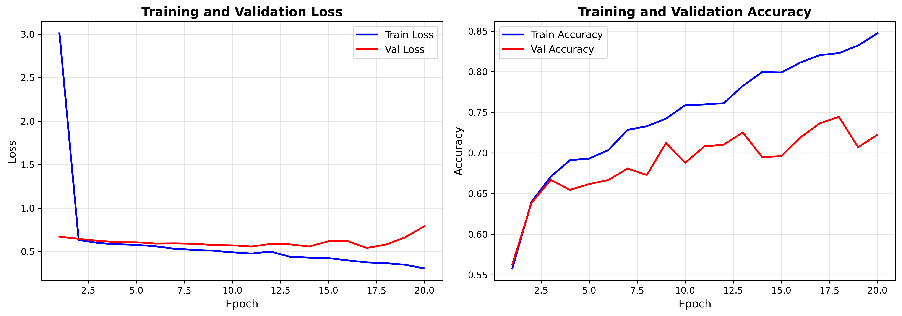
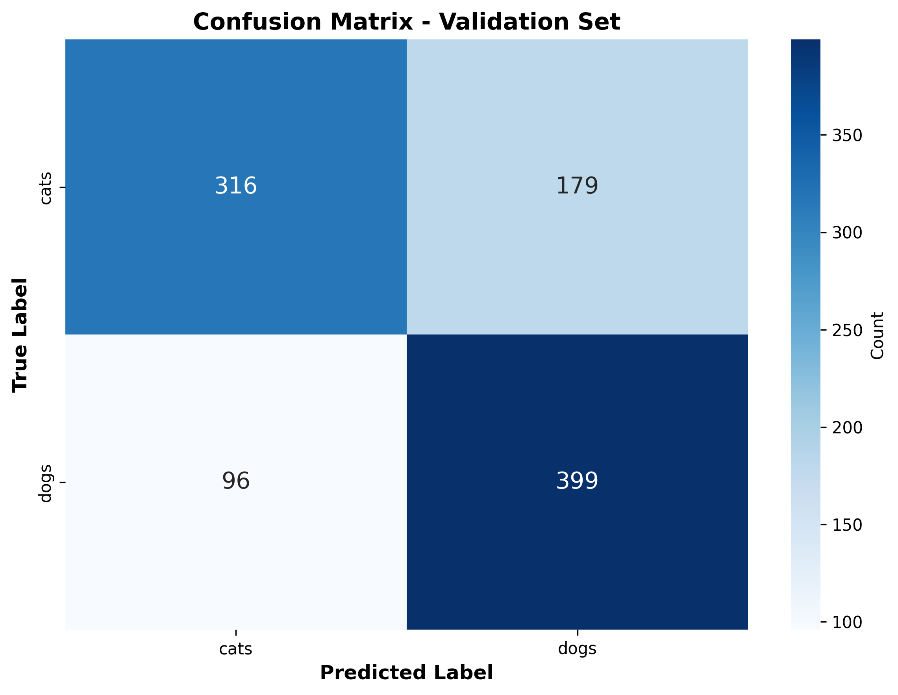
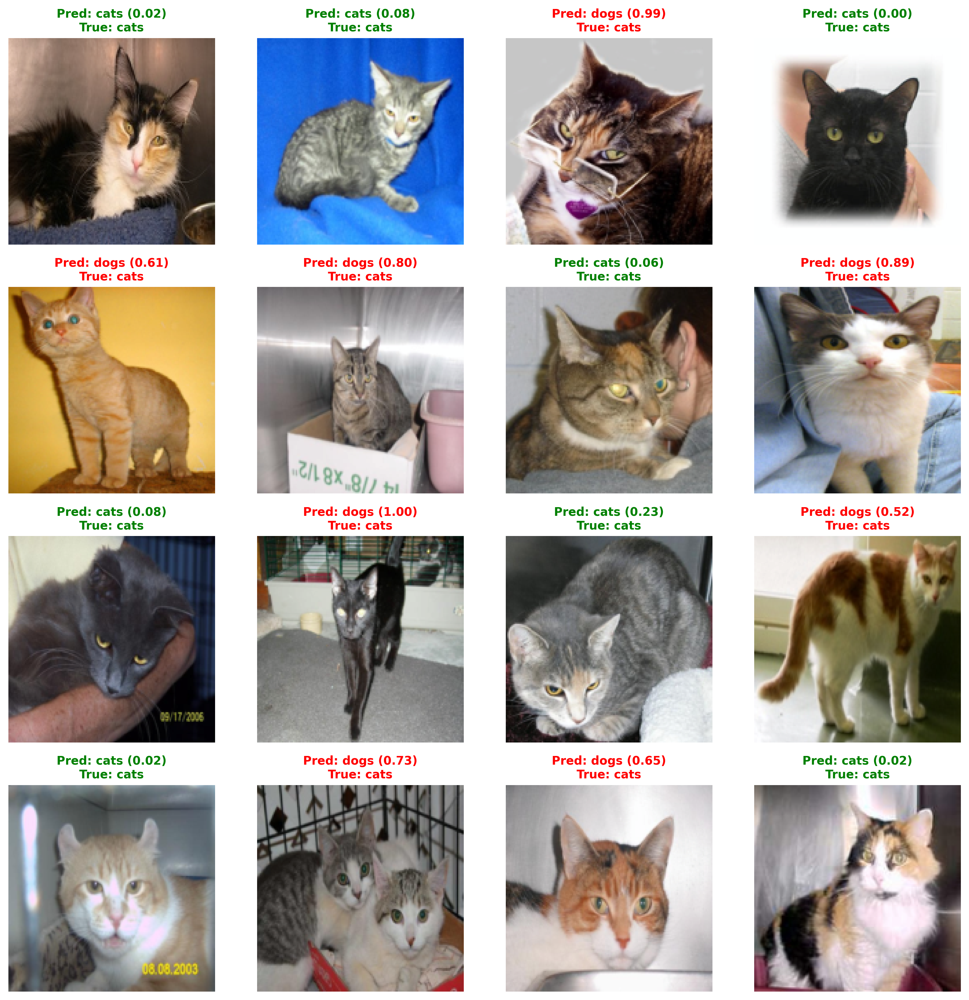

# 🐶🐱 Dogs vs Cats Classification — PyTorch

Binary image classification of dogs vs cats using a Convolutional Neural Network (CNN) built with PyTorch. This project demonstrates a complete machine learning pipeline from raw data acquisition to model evaluation and visualization.

## 📋 Table of Contents
* [📦 Dataset](#-dataset)
* [🔄 Data Pipeline](#-data-pipeline)
* [🧠 Model Architecture](#-model-architecture)
* [🏋️ Training Process](#-training-process)
* [📊 Evaluation & Results](#-evaluation--results)
* [📁 Project Structure](#-project-structure)
* [⚙️ Setup & Installation](#-setup--installation)
* [🚀 Usage](#-usage) 

---

## 📦 Dataset
The project uses the **Microsoft Dogs vs Cats dataset**. 
* **Total Images:** 25,000 images (12,500 each for cats and dogs).
* **Selection:** The pipeline automatically downloads and cleans the data, filtering out corrupt images.
* **Format:** Images are resized to **150x150 pixels** with RGB channels.

---

## 🔄 Data Pipeline
The data flows through a structured pipeline to ensure quality and reproducibility. Below is the visual representation of the complete process:




### Step-by-step breakdown:
1.  **Download:** Fetches the raw ZIP file and extracts it to `data/raw`.
2.  **Validate:** Scans for corrupt or non-image files to ensure dataset quality.
3.  **Prepare:** Organizes files into `train/` and `val/` directories with a configurable split.
4.  **Training:** Trains a custom 3-block CNN with Dropout and Batch Normalization.
5.  **Evaluation:** Generates metrics, confusion matrices, and validation reports.
6.  **Outputs:** Saves all results, models, and visualization plots to the `/output` folder.

---

## 🧠 Model Architecture
The model is a custom **Convolutional Neural Network (CNN)** designed for efficient binary classification. It follows a modular design with three convolutional blocks that progressively extract higher-level features from the images.



### Architecture breakdown:
*   **Input Layer:** Accepts RGB images of size **150x150x3**.
*   **Feature Extractors (3 Conv Blocks):**
    *   **Convolutional Layers:** Use 3x3 kernels to detect spatial patterns.
    *   **Batch Normalization:** Stabilizes learning and allows for faster convergence.
    *   **ReLU Activation:** Introduces non-linearity.
    *   **Max Pooling (2x2):** Reduces spatial dimensions by half (150→75→37→18), focusing on the most prominent features.
*   **Classifier Head:**
    *   **Flatten Layer:** Converts the 128x18x18 feature map into a 1D vector of 41,472 elements.
    *   **Dense Layer (256):** Learns complex relationships between extracted features.
    *   **Dropout (0.5):** Prevents overfitting by randomly deactivating 50% of neurons during training.
    *   **Output Layer:** A single unit that outputs logits for binary classification (Cat vs Dog).

---

## 🏋️ Training Process
The model was trained for **20 epochs** using **Binary Cross-Entropy with Logits Loss** and the **Adam optimizer**.

### Training curves:


**Observation:**
The curves show a steady decrease in loss and a corresponding increase in accuracy for both training and validation sets. The gap between training and validation accuracy remains controlled, indicating that the **Dropout** and **Batch Normalization** effectively mitigated overfitting.

---

## 📊 Evaluation & Results
The model achieves an overall validation accuracy of **~72%**.

### Confusion Matrix


### Classification Report
| Class | Precision | Recall | F1-Score | Support |
|-------|-----------|--------|----------|---------|
| Cats  | 0.77      | 0.64   | 0.70     | 495     |
| Dogs  | 0.69      | 0.81   | 0.74     | 495     |
| **Accuracy** | | | **0.72** | **990** |

### 🔍 In-Depth Result Analysis
1.  **Recall for Dogs (0.81):** The model is particularly strong at identifying dog images, successfully capturing 81% of all dogs in the validation set.
2.  **Precision for Cats (0.77):** When the model predicts "Cat", it is correct 77% of the time. This suggests that the model has learned distinct features for cats that reduce false positives for this class.
3.  **The "Dog Bias":** The lower precision for dogs (0.69) combined with high recall (0.81) indicates a slight bias towards predicting "Dog". This is common in early-stage CNNs where certain background features might be more frequently associated with the "Dog" label in the training data.
4.  **Overall Performance:** An accuracy of **72.22%** provides a robust baseline. Further improvements could be achieved through data augmentation (rotations, flips) or using a pre-trained backbone like ResNet.

### Sample Predictions
Below are visual examples of the model's performance on the validation set:


---

## 📁 Project Structure
```text
C:\Ai_Expert\L39-Dogs vs Cats Classification\
├───data/                   # Dataset storage (raw, train, val)
├───output/                 # Generated plots and metrics
├───src/                    # Source code
│   ├───download_data.py    # Data acquisition
│   ├───prepare_data.py     # Data cleaning and splitting
│   ├───model.py            # CNN Architecture
│   ├───train.py            # Training loop
│   └───evaluate.py         # Metrics and visualization
├───main.py                 # Pipeline entry point
└───pipeline_diagram.png    # Visual pipeline overview
```

---

## ⚙️ Setup & Installation
1.  **Clone the repository:**
    ```bash
    git clone <repository-url>
    cd L39-Dogs-vs-Cats-Classification
    ```
2.  **Install dependencies:**
    ```bash
    pip install -r requirements.txt
    ```

---

## 🚀 Usage
To run the entire pipeline (Download → Prepare → Train → Evaluate):
```bash
python main.py
```
Individual steps can be adjusted in the source code or run via specific scripts in the `src/` directory.
